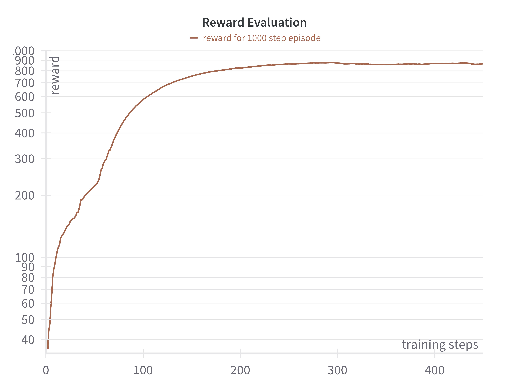

# Inverted Pendulum PPO

This repository implements a Proximal Policy Optimization (PPO) agent for a custom SwingUp Inverted Pendulum environment using MuJoCo, with a smooth, complex reward function adapted from DeepMind's Control Suite. The task consists of two goals: first, swinging up the pendulum and balancing it in an upright position; second, smoothly moving the pendulum's tip to touch a red ball that appears at the same height as the pendulum's length, with its position randomly changing after fixed time intervals.

## Reward Function

At each timestep, the reward is computed as the product of several smooth factors:

* **Upright**: Encourages the pole to remain upright:

  ```python
  upright = (cos(theta) + 1) / 2
  ```
* **Small Control**: Penalizes large force via a quadratic tolerance margin:

  ```python
  small_control = tolerance(action, bounds=(0.0, 0.0), margin=1.0, sigmoid='quadratic', value_at_margin=0.0)
  small_control = (4 + small_control) / 5
  ```
* **Small Angular Velocity**: Encourages slow pole movement with a cosine sigmoid:

  ```python
  small_theta_dot = tolerance(theta_dot, bounds=(0.0, 0.0), margin=5.0, sigmoid='cosine')
  small_theta_dot = (1 + small_theta_dot) / 2
  ```
* **Centered Cart and Tip**: Keeps both the cart and the pole tip near a target (ball) position along x and y axes using cosine sigmoids with margins.

The underlying `tolerance` function returns 1.0 when the variable is within a given bound, and otherwise applies a smooth decay determined by a choice of sigmoid shape. This design is borrowed and modified from the [DeepMind Control Suite](https://github.com/google-deepmind/dm_control/tree/cab6d386d40237b9eeacd3d8f06993eaee7aede6).

## Demo of Trained Agent

A demonstration of the trained PPO agent is provided in `demo_video.mp4`, showcasing the full swing-up, stabilization at the upright position, and smooth interception of the moving red ball. Below is the reward evaluation plot over the course of training:



## Hyperparameters

Hyperparameters for training were selected as described for the MuJoCo domain in Schulman, J. et al. "Proximal Policy Optimization Algorithms." [arXiv:1707.06347](https://arxiv.org/abs/1707.06347).

## How to Run

To train and evaluate the PPO agent locally, follow these steps:

1. **Clone the repository and navigate to it**

   ```bash
   git clone <repository_url>
   cd inv-pendulum-ppo
   ```
2. **Create a virtual environment and activate it**

   ```bash
   python3 -m venv venv
   source venv/bin/activate   # on Windows: venv\Scripts\activate
   ```
3. **Install dependencies**

   ```bash
   pip install -r requirements.txt
   ```
4. **Configure Weights & Biases**

   * Create a `.env` file in the project root with your API key:

     ```dotenv
     WANDB_API_KEY=YOUR_API_KEY
     ```
   * *Alternatively*, open `train.py` and modify the default in `class PPOConfig`:

     ```python
     wandb_api_key: str | None = "YOUR_API_KEY"
     ```
5. **Train the agent**

   ```bash
   python train.py
   ```
6. **Evaluate/test the trained agent**

   ```bash
   python testing.py 
   ```

   Replace `path=checkpoints/ppo_ipendulum_upd_complex_reward_centered_to_ball_200.pt` with the desired checkpoint file (e.g., the model saved at step 200).

## References

* DeepMind Control Suite: [https://github.com/google-deepmind/dm\_control/tree/cab6d386d40237b9eeacd3d8f06993eaee7aede6](https://github.com/google-deepmind/dm_control/tree/cab6d386d40237b9eeacd3d8f06993eaee7aede6)

* Schulman, J. et al. "Proximal Policy Optimization Algorithms." [arXiv:1707.06347](https://arxiv.org/abs/1707.06347)


